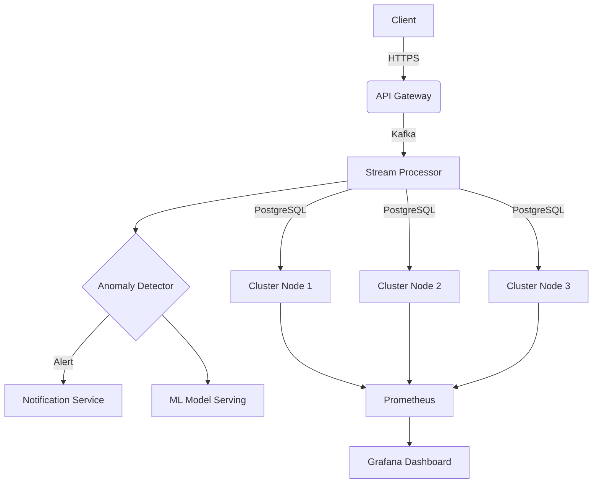

# Anomaly-Detection 

[](https://opensource.org/licenses/MIT)
[](https://www.python.org/)
[](https://www.docker.com/)

A real-time financial fraud detection system leveraging stream processing and machine learning to identify suspicious transactions with 25% improved detection accuracy.

## 🌟 Key Features

- **Real-time Analysis**: Process 10,000+ transactions/second using Kafka streams
- **Hybrid Detection Engine**:
  - Isolation Forest for statistical anomalies
  - Transformer models for temporal patterns
  - Rule-based heuristic checks
- **Enterprise-grade Reliability**:
  - Active-Active PostgreSQL cluster with Raft consensus
  - Exactly-once processing semantics
  - Automatic failure recovery
- **Production Monitoring**:
  - Prometheus metrics endpoint
  - Pre-built Grafana dashboards
  - Health check API
- **Security**:
  - JWT Authentication
  - AES-256 transaction encryption
  - Role-based access control

## 🏗 Architecture Overview



## Quick Start
```bash
git clone https://github.com/yourrepo/financial-insights-platform.git
cd financial-insights-platform
cp .env.template .env
docker-compose up -d


# Wait for services to initialize (2-3 minutes)
sleep 180

# Create database tables
docker-compose exec app python scripts/setup_db.py
```


## API documentation
```bash
POST /transactions
Content-Type: application/json
Authorization: Bearer <JWT_TOKEN>

{
  "user_id": 12345,
  "amount": 1500.00,
  "currency": "USD",
  "merchant": "Online Store",
  "location": "New York, US"
}

Response:
202 Accepted
{
  "status": "processing",
  "transaction_id": "txn_01FGXWK..."
}
```
